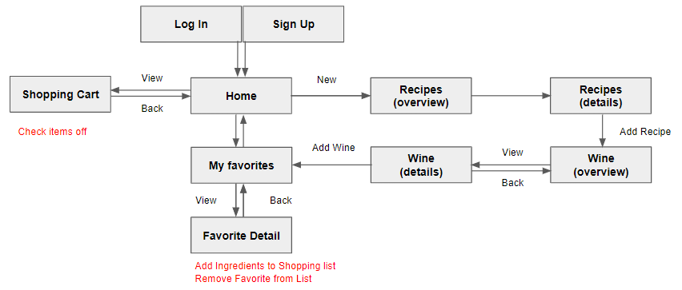

# Night-In

### Kathleen Dorse, Rudy Mendoza, Negin Rouhanizadeh, Tom Simon

### Table of Contents

- [About NightIn](###about-NightIn)
- [Usage](###usage)
- [App Flow Chart](###app-flow-chart)
- [Visualization of App Interface](###visualization-of-app-interface)
- [Contribute](###contribute)
- [Authors](###authors)

---

### About NightIn

Night In is a food and drink application that helps Wine and Food lovers alike curate perfectly matched meals. Starting with a meal of the user’s choice, Wine and Dine’s proprietary recommendation engine will suggest a nice drink pairing with your dinner. Users are able to create an account and store past pairings to your account history for future reference. Finally, Wine and Dine allows users to get the night started with a built-in shopping list.

### Live Link to Deployed App

[Night In App](https://nightinapp.herokuapp.com/)

### Technologies and APIs Used

- React and Reactstrap
- NodeJS
- Express
- NPM Passport
- Bootswatch
- MongoDB
- Google Fonts
- Cloudinary
- Wine Pairings/ Meal DB: https://docs.google.com/spreadsheets/d/1mlDgRpCYB9Xq-EduEBa82rmjEJAKDssJr3xFx8GvTw4/edit#gid=0

## Usage

- This react app runs in heroku or by running the command "npm start" to initialize the react server.
- This app has ten pages: SIGN UP, LOGIN, HOME, RECIPE, RECIPE Detail, WINE, WINE DETAIL, FAVOIRITES, FAVOIRITES DETAIL, SHOPPING LIST, LOGOUT

## App Flow Chart

## Visualization of App Interface

​

## Contribute

Please submit [bugs and feature requests](https://github.com/kathleendorse/NightIn/issues)

### Authors

[Kathleen Dorse](https://github.com/kathleendorse)

---

[Negin Rouhanizadeh](https://github.com/nrouhanizdeh)

---

[Rudy Mendoza](https://github.com/mendozar)

---

[Tom Simon](https://github.com/tomone)

